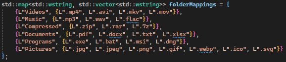

# 📂 Downloads Folder Cleaner 
Tidy up your cluttered downloads folder! This C++ tool organizes your Downloads folder into neatly categorized subfolders:

🚨‼️BEWARE‼️🚨
If **you have trust issues** and want to compile the source code yourself make sure to use >`C++17` to ensure compatibility with the `<filesystem>` library...

---
### 🗂 Categories:[request for more extension is highly appreciated]
- **Compressed**: `.zip`, `.rar`, `.7z`
- **Documents**: `.pdf`, `.docx`, `.xlsx`, `.txt`  
- **Music**: `.mp3`, `.wav`, `.flac`
- **Picture**: `.jpg`, `.jpeg `, `.png`, `.gif`, `.webp`, `.ico`, `.svg`
- **Programs**: `.exe`, `.msi`, `.dmg`, `.bat`
- **Videos**: `.mp4`, `.mkv`, `.avi`,  `.mov`
- **Others**: Anything that doesn't fit the above categories including other folders 

For ease, if you decide to pull request, the code block for the above is here

✨ bye bye messy download folders!  

---

## 🚀 Features
- Automatically sorts files into relevant categories.  
- Lightweight and fast.  
- Just execute and relax  
- Customize folder names and file type categories.  

